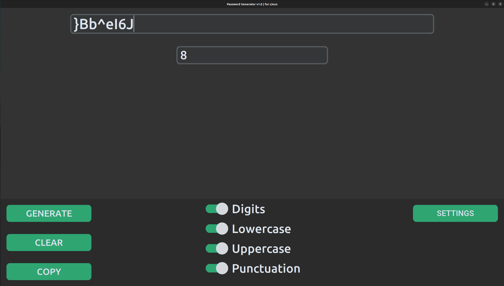
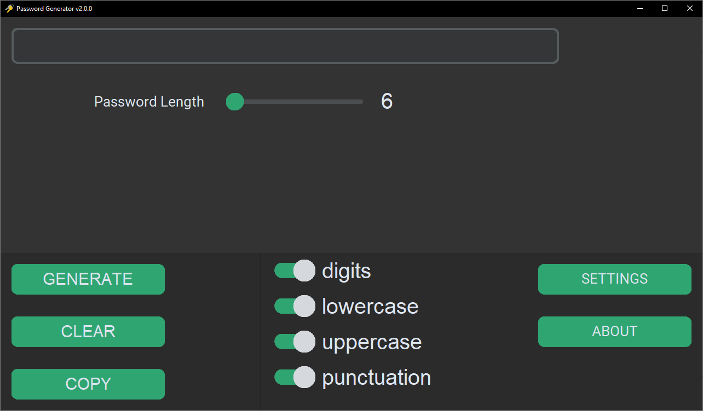
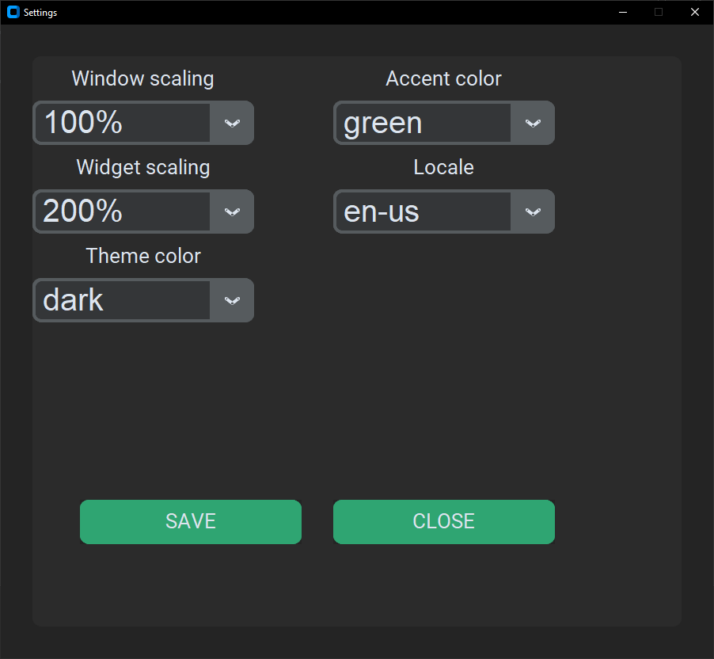

# PasswordGenerator-GUI (v2.2.0)
## ❓ About
**Password Generator** with graphical interface on *customtkinter*.  
It`s basicaly project i made for fun. And as well for **password generation** purposes.  
So you can *contribute* this, you can *request new features*.

 

## 🖼️ Screenshots
**Linux (v1.0)**  

  

**Windows 10 - Main app window (v2.0.0)**  

  

**Windows 10 - Settings window (v2.0.0)**  

  

## ⚙️ Compatibility
| **Operation System** | **Status** | **Version**|
| :---------: | :-----------: | :-----------: |
| **Windows** | 🟢 Compatible | v2.2.0 |
| **Linux** | 🟡 Not tested | x |
| **MacOS** | 🟡 Not tested | x |

  

## 🖥️ Contribution
⭐ This repo is just for fun ⭐
 
ㅤㅤYou can contribute it.
