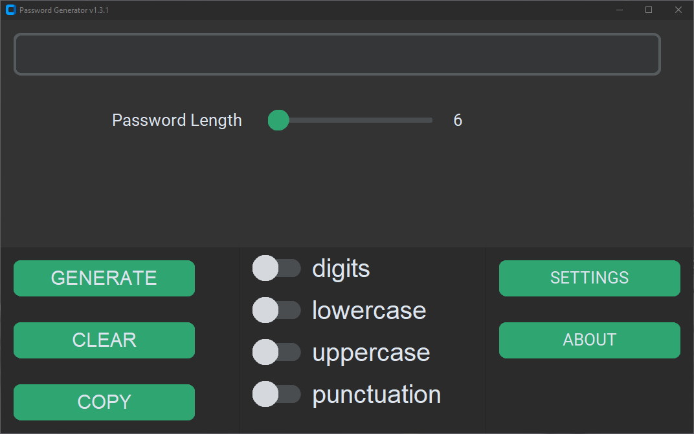

# PasswordGenerator-GUI (v2.0.0)
## ❓ About
**Password Generator** with graphical interface on *customtkinter*.  
It`s basicaly project i made for fun. And as well for password generation purposes.  
So you can contribute this, you can request new features.

 

## 🖼️ Screenshots
**Linux (v1.0)**  

  

**Windows (v1.3.1)**
  

  

## ⚙️ Compatibility
| **Operation System** | **Status** | **Version**|
| :---------: | :-----------: | :-----------: |
| **Windows** | 🟢 Compatible | v2.0.1 |
| **Linux** | 🟡 Not tested | x |
| **MacOS** | 🟡 Not tested | x |

  

## 
🖥️ Contribution

⭐ This repo is just for fun ⭐

 

 You can contribute it.

